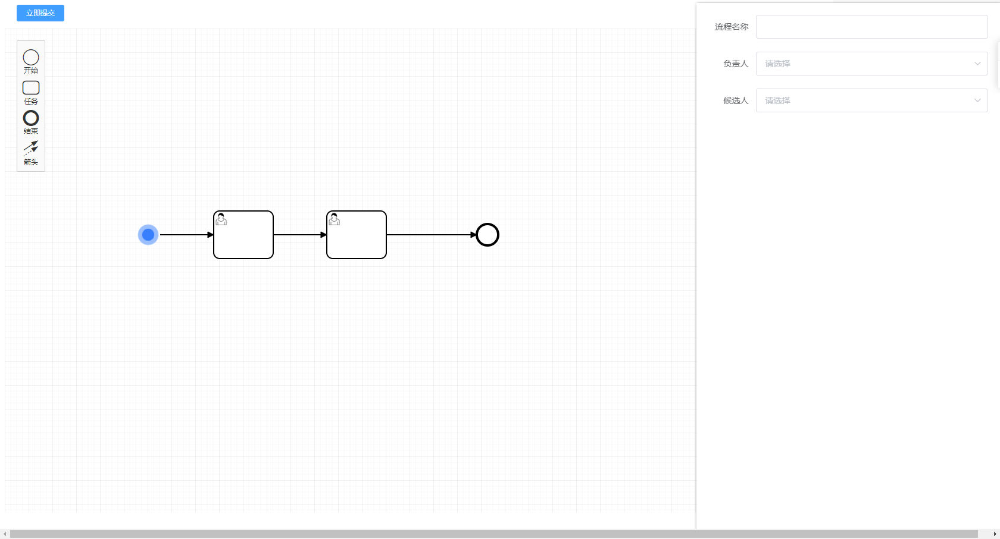
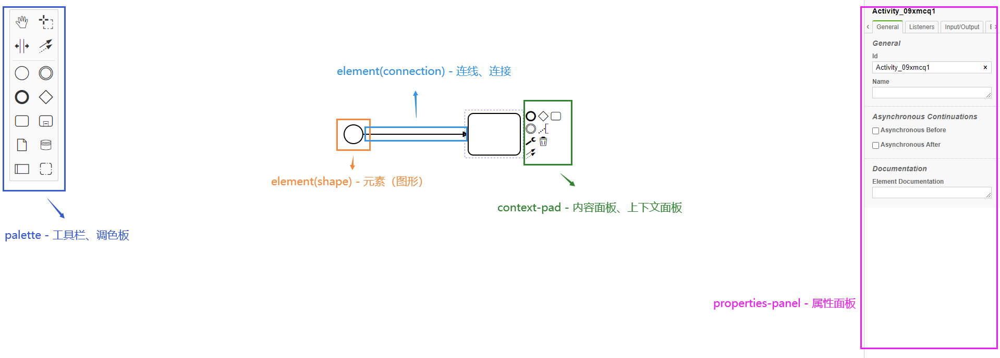

# bpmn_vue
bpmn-js 是 BPMN 2.0 呈现工具包和 Web 建模器。它是用 JavaScript 编写的，将 BPMN 2.0 图表嵌入到现代浏览器中，并且不需要服务器后端。这样可以轻松将其嵌入到任何 Web 应用程序中。

该库以既可以查看器又可以是 Web 建模器的方式构建。使用 viewer 将 BPMN 2.0 嵌入到您的应用程序中，[并用您的数据丰富它](https://bpmn.io/)。使用 modeler 在应用程序内部创建 BPMN 2.0 图表。

####描述
本人也是新手，借鉴了好多大佬的代码与文档，有些地方可能总结不到位或者用词不当，以后会系列更新的。望各位大佬多多指点。

##联系我
 - 博客园 https://www.cnblogs.com/qhantime/
 - CSDN https://blog.csdn.net/qq_44938782
 - QQ+邮箱 851636176@qq.com

##教程
   LinDaiDai 的教程文档:[点击这里到教程](https://github.com/LinDaiDai/bpmn-chinese-document/blob/master/directory.md) https://github.com/LinDaiDai/bpmn-chinese-document/blob/master/directory.md
   
   penglianger 的教程文档:[点击这里到教程]( https://hub.fastgit.org/PL-FE/bpmn-doc)  https://hub.fastgit.org/PL-FE/bpmn-doc
   
   我的BPMN元素的基本介绍  [BPMN基本元素](src/doc/me/bpmnElement.md)  
##示例
   这是我的首页
   
##相关
   penglianger的文档我引用进来了大家可以看看,去他的git上看更好>>> [点击这里跳转](https://hub.fastgit.org/PL-FE/bpmn-doc)
   
   [1 介绍](src/doc/quickIntroduction.md)  
   [2 addFeatures 为 Viewer 添加一些功能](src/doc/addFeatures.md)  
   [3 基础使用](src/doc/baseBpmn.md)  
   [4 bpmnApi](src/doc/bpmnApi.md)  
   [5 设置颜色](src/doc/customConnectionColor.md)  
   [6 自定义 contextPad](src/doc/customContextPad.md)  
   [7 MiniMap](src/doc/customMiniMap.md)  
   [8 自定义 Palette](src/doc/customPalette.md)  
   [9 指定 Palette 容器](src/doc/customPaletteContainer.md)  
   [10 自定义 properties-panel](src/doc/customPropertiesPanel.md)  
   [11 自定义 Rules](src/doc/customRules.md)  
 
 
##以下是我的开发文档
   
###### 1安装bpmn
      npm i bpmn-js --save-D
###### 2 在main.js中引入bpm依赖 
         // 以下为bpmn工作流绘图工具的样式
        import 'bpmn-js/dist/assets/diagram-js.css' // 左边工具栏以及编辑节点的样式
        import 'bpmn-js/dist/assets/bpmn-font/css/bpmn.css'
        import 'bpmn-js/dist/assets/bpmn-font/css/bpmn-codes.css'
        import 'bpmn-js/dist/assets/bpmn-font/css/bpmn-embedded.css'
        // 右边工具栏样式 要单独安装npm i bpmn-js-properties-panel --save-D
        import 'bpmn-js-properties-panel/dist/assets/bpmn-js-properties-panel.css' // 右边工具栏样式
        
        //引入解析xml插件// npm install x2js
        import x2js from 'x2js'  
        Vue.prototype.$x2js = new x2js()
###### 2.1 x2js的使用 
    Let obj = this.$x2js.xml2js(xml)  //xml转js对象
    Let xml = this.$x2js.js2xml(obj)  //js对象转xml

