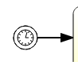
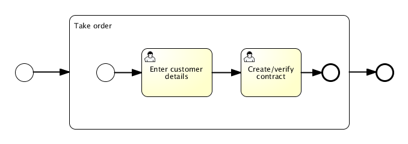

## 1 顺序流（sequence flow）  

    

> 顺序流是流程中两个元素间的连接器。在流程执行过程中，一个元素被访问后，会沿着其所有出口顺序流继续执行。这意味着BPMN 2.0的默认是并行执行的：两个出口顺序流就会创建两个独立的、并行的执行路径。     用从源元素指向目标元素的箭头表示。箭头总是指向目标元素。

- 在顺序流上可以定义条件（conditional sequence flow），默认行为是计算其每个出口顺序流上的条件。当条件计算为true时，选择该出口顺序流。
- 条件顺序流的XML表示格式为含有conditionExpression（条件表达式）子元素的普通顺序流。

```vue
 <sequenceFlow id="flow" sourceRef="theStart" argetRef="theTask">
  <conditionExpression xsi:type="tFormalExpression">
    <![CDATA[${order.price > 100 && order.price < 250}]]>
  </conditionExpression>
 </sequenceFlow>
```

## 2 活动任务

#### 用户任务

> 用户任务（user task）用于对需要人工执行的任务进行建模。当流程执行到达用户任务时，会为指派至该任务的用户或组的任务列表创建一个新任务。

图示


- 用户任务用左上角有一个小用户图标的标准任务（圆角矩形）表示。
- 用户任务可以直接指派（assign）给用户，设置任务到期时间，设置任务的候选用户/候选用户组，并能设置任务的监听器与自定义指派。

```vue
<userTask id="task1" name="My task" >
 <extensionElements>
   <flowable:taskListener event="create" class="org.flowable.MyAssignmentHandler" />
 </extensionElements>
</userTask>
```

#####  服务任务

> 服务任务（service task）用于调用Java类。流程执行到服务任务时，会自动运行Java程序中的代码流程。

图示


- 服务任务用左上角有一个小齿轮图标的圆角矩形表示。

```vue
<serviceTask id="javaService"
            name="My Java Service Task"
            flowable:class="com.inossem.MyJavaDelegate" />
```

- 或使用表达式，结合spring的IOC机制，如下使用。

```vue
<serviceTask id="serviceTask" flowable:delegateExpression="${springBeanName}" />
```

#### 网关

##### 排他网关

> 排他网关（exclusive gateway）（也叫异或网关 XOR gateway，或者更专业的，基于数据的排他网关 exclusive data-based gateway），用于对流程中的**决策**建模。当执行到达这个网关时，会按照所有出口顺序流定义的顺序对它们进行计算。选择第一个条件计算为true的顺序流（当没有设置条件时，认为顺序流为*true*）继续流程。

图示


- 排他网关用内部带有’X’图标的标准网关（菱形）表示，'X’图标代表异或的含义。请注意内部没有图标的网关默认为排他网关。BPMN 2.0规范不允许在同一个流程中混合使用有及没有X的菱形标志。

##### 并行网关

> 网关也可以建模流程中的并行执行。在流程模型中引入并行的最简单的网关，就是**并行网关（parallel gateway）**。它可以将执行分支（fork）为多条路径，也可以合并（join）多条入口路径的执行。

并行网关的功能取决于其入口与出口顺序流：

- **分支：**所有的出口顺序流都并行执行，为每一条顺序流创建一个并行执行。
- **合并：**所有到达并行网关的并行执行都会在网关处等待，直到每一条入口顺序流都到达了有个执行。然后流程经过该合并网关继续。

如果并行网关同时具有多条入口与出口顺序流，可以**同时具有分支与合并的行为**。在这种情况下，网关首先合并所有入口顺序流，然后分裂为多条并行执行路径。

**与其他网关类型有一个重要区别：并行网关不计算条件。如果连接到并行网关的顺序流上定义了条件，会直接忽略该条件。**

图示


并行网关，用内部带有’加号’图标的网关（菱形）表示，代表与（AND）的含义。

#### 事件

##### 启动&结束事件

> 启动事件（start event）是流程的起点。启动事件的类型（流程在消息到达时启动，在指定的时间间隔后启动，等等），定义了流程如何启动，并显示为启动事件中的小图标。在XML中，类型由子元素声明来定义。

启动事件可以有多种类型，如：空启动事件、定时器启动事件、消息启动事件、信号启动事件、错误启动事件等。

图示


空启动事件



定时器启动事件


消息启动事件

> 结束事件（end event）标志着流程或子流程中一个分支的结束。结束事件总是抛出型事件。这意味着当流程执行到达结束事件时，会抛出一个结果。结果的类型由事件内部的黑色图标表示。

结束事件同样有多种类型

图示


空结束事件


错误结束事件


取消结束事件

##### 边界事件

> 边界事件（boundary event）是捕获型事件，依附在活动（activity）上。边界事件永远不会抛出。这意味着当活动运行时，事件将监听特定类型的触发器。当捕获到事件时，会终止活动，并沿该事件的出口顺序流继续。

图示


错误边界事件用内部有一个错误图标的标准中间事件（两层圆圈）表示。错误图标是白色的，代表捕获的含义。

##### 抛出&捕获事件

捕获中间事件用内部有对应事件图标的标准中间事件（两层圆圈）表示。图标是白色的（未填充），代表捕获的含义。

图示


抛出中间事件用内部有对应事件图标的标准中间事件（两层圆圈）表示。图标是黑色的（已填充），代表抛出的含义

图示


#### 子流程与调用活动

##### 子流程

在BPM表中有子流程和引用活动的概念，如果一个流程在多个环节中使用，那么就可以考虑将该流程拆分为一个独立的子流程，这样其他的流程引入该流程就可以。子流程和引用活动的目的是简化繁琐重复流程的配置，也便于在流程图中对整个环节进行跟踪。

子流程有两个主要的使用场景：

- 子流程可以**分层建模**。很多建模工具都可以折叠子流程，隐藏子流程的所有细节，而只显示业务流程的高层端到端总览。
- 子流程会创建新的**事件范围**。在子流程执行中抛出的事件可以通过子流程边界上的边界事件捕获，为该事件创建了限制在子流程内的范围。

使用子流程也要注意以下几点：

- 子流程只能有**一个空启动事件**，而不允许有其他类型的启动事件。请注意BPMN 2.0规范允许省略子流程的启动与结束事件，但目前Flowable的实现尚不支持省略。
- **顺序流不能跨越子流程边界。**

图示

子流程表示为标准活动(圆角矩形)。若折叠了子流程，则只显示其名字与一个加号，以展示流程的高层概览：


若展开了子流程，则在子流程内显示子流程的所有步骤：



##### 调用活动

从图示上看起来很相像子流程，但在BPMN 2.0中，调用活动（call activity）有别于一般的子流程（子流程通常也称作嵌入式子流程）。从概念上说，两者都在流程执行到达该活动时，调用一个子流程。

两者的区别为，调用活动引用一个流程定义外部的流程，而子流程嵌入在原有流程定义内。调用活动的主要使用场景是，在多个不同流程定义中调用一个可复用的流程定义。

当流程执行到达*调用活动*时，会创建一个新的执行，作为到达调用活动的执行的子执行。这个子执行用于执行子流程，也可用于创建并行子执行（与普通流程中行为类似）。父执行将等待子流程完成，之后沿原流程继续执行。

图示

调用过程表现为带有粗边框（折叠与展开都是）的子流程。取决于建模工具，调用过程可以展开，但默认表现为折叠形式。


## 3 工作流引擎与工程结合的解决方案

### 方式一

将系统中对于审批/经办等内容交给工作流引擎处理，其他复杂的传统业务由代码处理。

此种方式可以将相对比较固定的审批流转、委托代办、会签或签等功能分离给工作流引擎处理，而相对复杂的各种业务仍然采用代码定制的方式来拟合业务

这样做的优点是，对于各种复杂的权限判断，业务上的复杂处理，牢牢掌握在自己手中，对于业务流转、条件判断等直接使用代码解决，理解起来简单，操作上直接。

缺点方面，工作流引擎形同虚设，没有发挥出更大作用。

形象的例子是：你到餐馆去吃饭，想要吃一份儿水煮鱼，你认识会做水煮鱼的厨师，直接来到后厨，找到厨师并且提供给厨师全套厨具以及待烹饪的生鱼让他给你做饭。简单直接，没有中间服务员点菜和传菜的步骤，做菜的指令直接传递给厨师，菜做好了也是直接交给你的。

### 方式二

作为业务调度中心

业务中的每一个步骤的具体执行由代码完成，而步骤之间的所有衔接全部交由工作流引擎处理。业务发起时，调用方只负责将对应的发起人和要发起的业务代码传递给工作流引擎，其余的事情交给引擎自己去调度。

以仓储业务的入库单的提交为例：

从单据提交，发起审批，保存批次信息，保存单据信息，到根据配置生成仓库作业请求，修改库存，回调修改单据状态等等，各个环节的启动与流转，完全交给工作流引擎调度。发起方只需要去关注整个业务的进展状态即可，不再关注后续执行的细节（如何时生成请求，应该使用什么作业模式等等）

这种做法的优点是，发起方与执行方进行了拆分，引入了调度协调器的角色。业务的执行依赖调度器的串联。发起方不必再关注后续的细节，只需关注业务本身的流转状态。业务流程的编排由事先指定好的BPMN模型定义。

缺点方面，引入了更多的复杂度，工作流引擎成为了系统的核心运转依赖组件，需要在数据一致性、并发、与高性能方面做更多的设计与考量。

## 4 使用BPMN及工作流引擎来处理业务流程的优缺点讨论

### 优点

业务流程间的可视配置化

开发与业务人员间的交流语言得到了统一

使知识（业务、决策逻辑、具体执行等）可以得到更大范围的沉淀

### 缺点

#### 性能表现

流程节点（任务）本身在执行过程中经历了更多的步骤以及持久化过程，对于性能上以及优化上引入了更大的复杂度。

#### 既有研发方式的变化

难以在代码层级对跨任务的执行过程进行切面处理。工作流的引入，对于AOP的使用带来了很多困难，例如使用AOP实现的日志、特定的验证和数据包装等，原先很简单的一个实现方式，现在变得非常复杂。

#### 单一的应用BPMN会存在一些局限，复合使用则略显复杂

结合CMMN、DMN进行业务的支持

BPMN强调的是流程与固定步骤的执行，CMMN强调的是事件驱动的动态案例执行，DMN侧重于流程中的决策的汇总与整合。

举例：

家具厂生产家具，生产橱柜和沙发，橱柜和沙发的生产流程都是固定的，使用BPMN来解决橱柜生产和沙发生产的流程是合适的。而如果将完成生产订单的业务整体来建模，则生产橱柜和沙发的流程对于一个订单来说，可能不存在严格的先后顺序，更多的是基于事件和决策的执行，比如当订单客户有客制化要求，或者原材料供应商是否能够按时供应等等。使用BPMN中的并行网关+事件处理也能完成业务建模，但可能导致模型复杂。

#### BPMN的事务处理

##### 与数据库事务的比较

单个任务执行过程是一个传统数据库事务，整个流程是一个长活事务。

整个流程的事务表现上更具有明显的分布式事务的特征。

事务失败回滚补偿机制的问题需要进行更多考虑。

> **Saga模式**
>
> 1987年普林斯顿大学的Hector Garcia-Molina和Kenneth Salem发表了一篇Paper Sagas，讲述的是如何处理long lived transaction（长活事务）。Saga是一个长活事务可被分解成可以交错运行的子事务集合。其中每个子事务都是一个保持数据库一致性的真实事务。 论文地址：[sagas](https://www.cs.cornell.edu/andru/cs711/2002fa/reading/sagas.pdf)
>
> **Saga的组成及执行顺序**
>
> - 由一系列sub-transaction Ti 组成
> - 每个Ti 都有对应的补偿动作Ci，补偿动作用于撤销Ti造成的结果
>
> 执行顺序为下列两种情况的任意一种
>
>  
>
> ，其中
>
> **Saga定义的两种恢复策略：**
>
> - backward recovery，向后恢复，补偿所有已完成的事务，如果任一子事务失败。即上面提到的第二种执行顺序，其中j是发生错误的sub-transaction，这种做法的效果是撤销掉之前所有成功的sub-transation，使得整个Saga的执行结果撤销。
> - forward recovery，向前恢复，重试失败的事务，假设每个子事务最终都会成功。适用于必须要成功的场景，执行顺序是类似于这样的：T1, T2, ..., Tj(失败), Tj(重试),..., Tn，其中j是发生错误的sub-transaction。该情况下不需要Ci。
>
> [关于saga的话题更多参考](https://www.jianshu.com/p/e4b662407c66?from=timeline&isappinstalled=0)

> **BPMN事务块的作用**
>
> 结合BPM在业界的应用，事务块（Transaction）旨在将一组具有一定业务关系或为同一个业务目标服务的活动看作一个事务逻辑单元，这个逻辑单元完全结束才能满足或达到业务目标，如果其中任何一个失败就必须全部撤回（补偿），如下例是一个在网上订购机票和酒店的例子：
>
> 
>
> 当用户发出一个网上订购机票和酒店的请求后，后台流程会将请求及相关表单信息传递给事务块处理，事务块会像一个子流程一样启动，并同时调用订机票和订酒店的两个活动，这两个活动会像第三方（大家可以想像一下携程的业务）发出订购请求，其中任何一个环节出现问题后，事务块将触发Cancellation事件（一个Cancellation事件可能会被两种方式触发：API或流程本身），事务块抛出该事件，并由事务块的边界取消事件捕获，并触发其块内两个活动上的补偿动作，从而取消机票或酒店的订单动作。当然一个事务块中也可能出现其它的一些未被有效处理的错误，这些错误也可经由边界异常事件捕获，从而进行这些错误出现后的例外处理，如转人工客服。